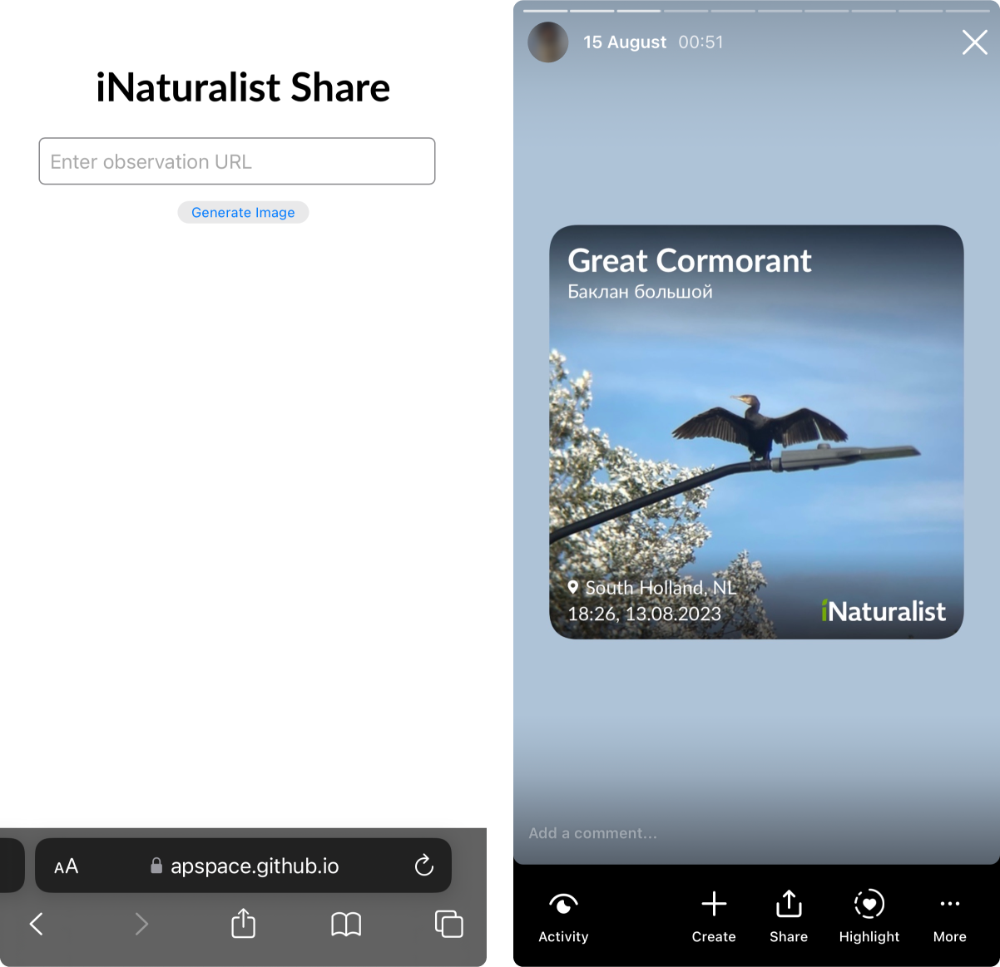

# iNaturalist Share
Simple tool that turns your nature observations from iNaturalist into beautiful, shareable images.

## Features
This tool fetches observation data from iNaturalist, generates a canvas with the observation image, location, and time, and converts it into a PNG image. The generated image is then displayed on the page, ready for sharing.

## Usage
1. Enter the URL of an iNaturalist observation in the input field.
2. Click the "Generate Image" button.
3. The generated image will be displayed on the page, ready for sharing.
4. Right-click on the image to save it locally or use the share functionality of your browser.

## Demo
Check out the live demo [here](https://apspace.github.io/iNaturalist-Share/).

## License
This project is licensed under the MIT License.
